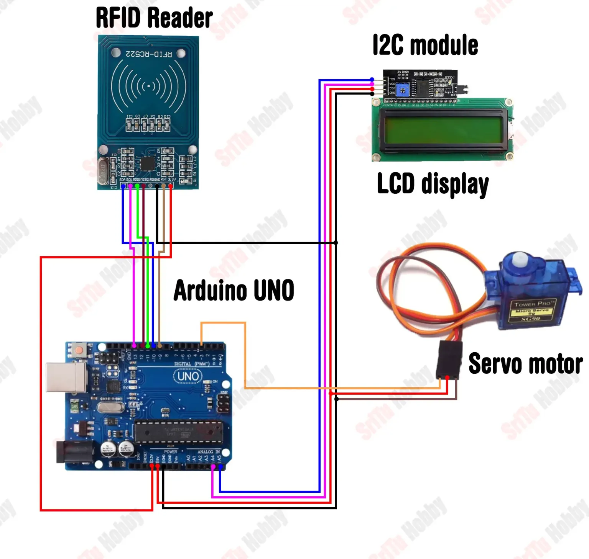
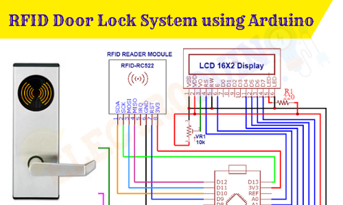

# RFID Door Lock System 🚪🔒

This project is an **RFID-based door lock system** that uses RFID technology to provide secure access. It controls the door lock by reading RFID tags and granting access only to authorized users.

## 🔹 Description
The **RFID Door Lock System** works by scanning an RFID tag using the **MFRC522 RFID Reader Module** and matching it with a stored ID. If the tag is authorized, it triggers a servo motor to unlock the door. If unauthorized, an alert is issued via a buzzer.

## 🔹 Components Used
- **Arduino Uno**: The microcontroller that processes the data and controls the components.
- **MFRC522 RFID Module**: Reads the RFID tag to retrieve its unique ID.
- **Servo Motor**: Used to unlock the door when authorized.
- **Buzzer**: Provides an alert for unauthorized access.
- **LED**: Used to show the system's status.
- **Jumper Wires**: Connect the components together.
- **Breadboard**: For connecting and organizing the circuit components.
- **Power Supply**: To power the system.

## 🔹 Key Features
- ✅ **Secure RFID-based access**: Grants entry only to authorized users.
- ✅ **Easy to set up**: Simple to assemble with Arduino and components.
- ✅ **Visual and sound alerts**: Provides status updates using LED and buzzer.
- ✅ **Low cost**: Affordable components for secure access control.
- ✅ **Expandability**: Can be integrated with additional security features.

## 🔹 Installation & Setup



1. Setup the components as shown in the above diagram.

2. Upload the provided Arduino code to your Arduino Uno using the Arduino IDE.


3. Connect the components as shown in the circuit diagram.


4. Power the system with a 5V supply to test the setup.


🔹 Code Overview

The Arduino code initializes the RFID reader and waits for the user to scan an authorized RFID tag. If the tag matches the stored ID, the servo motor unlocks the door. Unauthorized tags trigger a buzzer sound as an alert.


 ## 🔹 Source Code and Files

## 🔹 Source Code

```cpp
#include <Servo.h>
#include <LiquidCrystal_I2C.h>
#include <SPI.h>
#include <MFRC522.h>

#define SS_PIN 10
#define RST_PIN 9
String UID = "15 75 FE 28";
byte lock = 0;

Servo servo;
LiquidCrystal_I2C lcd(0x27, 16, 2);
MFRC522 rfid(SS_PIN, RST_PIN);

void setup() {
  Serial.begin(9600);
  servo.write(70);
  lcd.init();
  lcd.backlight();
  servo.attach(3);
  SPI.begin();
  rfid.PCD_Init();
}

void loop() {
  lcd.setCursor(4, 0);
  lcd.print("Welcome!");
  lcd.setCursor(1, 1);
  lcd.print("Put your card");

  if ( ! rfid.PICC_IsNewCardPresent())
    return;
  if ( ! rfid.PICC_ReadCardSerial())
    return;

  lcd.clear();
  lcd.setCursor(0, 0);
  lcd.print("Scanning");
  Serial.print("NUID tag is :");
  String ID = "";
  for (byte i = 0; i < rfid.uid.size; i++) {
    lcd.print(".");
    ID.concat(String(rfid.uid.uidByte[i] < 0x10 ? " 0" : " "));
    ID.concat(String(rfid.uid.uidByte[i], HEX));
    delay(300);
  }
  ID.toUpperCase();

  if (ID.substring(1) == UID && lock == 0 ) {
    servo.write(70);
    lcd.clear();
    lcd.setCursor(0, 0);
    lcd.print("Door is locked");
    delay(1500);
    lcd.clear();
    lock = 1;
  } else if (ID.substring(1) == UID && lock == 1 ) {
    servo.write(160);
    lcd.clear();
    lcd.setCursor(0, 0);
    lcd.print("Door is open");
    delay(1500);
    lcd.clear();
    lock = 0;
  } else {
    lcd.clear();
    lcd.setCursor(0, 0);
    lcd.print("Wrong card!");
    delay(1500);
    lcd.clear();
  }
}
```

## 🔹 Circuit Diagram


🔹 How It Works

   1. Scan the RFID tag: Place the RFID tag near the RFID reader.


   2. If the tag is authorized, the servo motor unlocks the door.


   3. If the tag is unauthorized, the system triggers a buzzer for an alert.


🔹 Future Enhancements

 - Add password protection for extra security.

 - Implement email or SMS notifications for access logs.

 - Integrate with mobile app for remote access.

 - Expand the system to handle multiple RFID tags and users.
